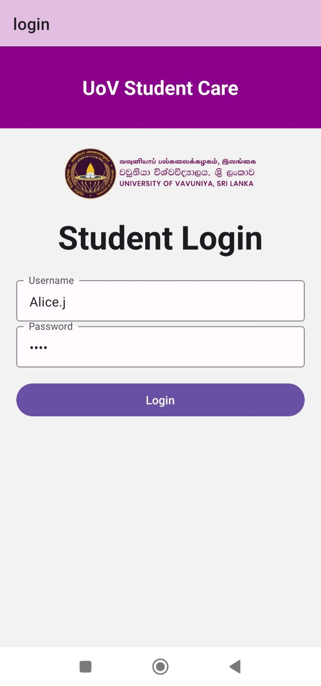
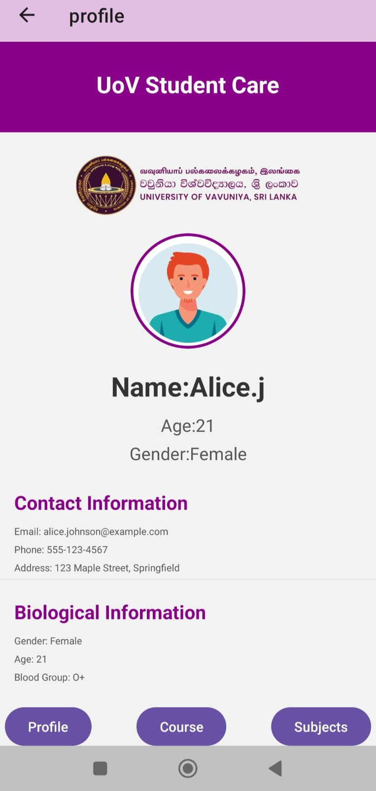
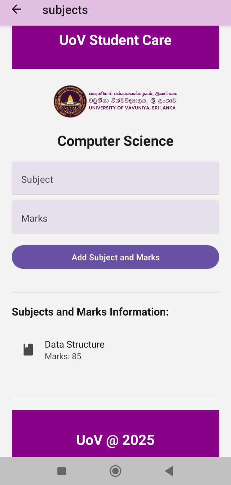

# UoV Student Care App

A React Native mobile application for managing student information, courses, and academic records at the University of Vision (UoV).

## Features

- **Student Authentication**
  - Secure login system for students
  - User-specific profile access

- **Student Profile Management**
  - View and manage personal information
  - Display profile picture
  - Show contact details
  - Display biological information

- **Course Information**
  - View course details
  - Access course code and department information
  - Check course duration and descriptions

- **Academic Records**
  - Add and track subject marks
  - Calculate average marks automatically
  - View comprehensive subject list
  - Real-time grade updates

## Application Screens

### 1. Login Screen
- Student authentication interface
- Username and password input fields
- Login button
- UoV logo display
- Purple-themed header


### 2. Profile Screen
- Personal information display
- Profile picture
- Contact information section
- Biological information section
- Navigation buttons for Course and Subjects
- Responsive layout with purple accents


### 3. Course Screen
- Course name and code display
- Department information
- Course duration
- Course description
- Clean, card-based layout
- UoV branding elements


### 4. Subjects Screen
- Subject and marks input form
- List of added subjects with marks
- Average marks calculation
- Interactive subject list with icons
- Real-time grade updates


## Technologies Used

- React Native
- React Navigation
- React Native Paper
- Expo

## Project Structure

```
UoV-Student-Care/
├── components/
│   ├── Login.js        # Student authentication
│   ├── Profile.js      # Student profile management
│   ├── Course.js       # Course information display
│   └── Subjects.js     # Academic record management
├── assets/
│   └── uovlogo.png     # Application logo
├── data/
│   └── StudentsDb.js   # Student database
└── App.js              # Main application file
```

## Installation

1. Clone the repository:
```bash
git clone https://github.com/IT3133-Practical/Assignment-03-studentcareApp.git
```

2. Install dependencies:
```bash
cd studentCare
npm install
```

3. Start the development server:
```bash
npx expo start
```

## Dependencies

- @react-navigation/native
- @react-navigation/native-stack
- react-native-paper
- react-native-safe-area-context
- expo-status-bar

## Usage

1. Launch the application
2. Log in using student credentials
3. Navigate through different sections using the bottom navigation buttons:
   - Profile
   - Course
   - Subjects

## Styling

The application uses a consistent purple theme (#8b008b) throughout its interface with:
- Clean and modern UI components from React Native Paper
- Responsive layouts
- Consistent header styling
- User-friendly form inputs

## Contributing

1. Fork the repository
2. Create your feature branch (`git checkout -b feature/AmazingFeature`)
3. Commit your changes (`git commit -m 'Add some AmazingFeature'`)
4. Push to the branch (`git push origin feature/AmazingFeature`)
5. Open a Pull Request
